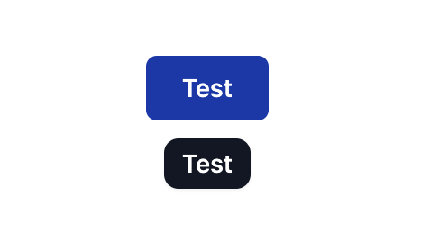

<p align="center">
  <a href="https://www.typescriptlang.org" _target="blank">
    
  </a>
  <a href="https://eslint.org/ _target="blank"">
    
  </a>
  <a href="https://svelte.dev" _target="blank">
    
  </a>
  <a href="https://pnpm.io" _target="blank">
    
  </a>
  <a href="https://prettier.io/" _target="blank">
    
  </a>
  <a href="https://www.npmjs.com/package/svelte-tippy" _target="blank">
    
  </a>
</p>

# Tippy.js for svelte

A svelte action for creating tippy.js tooltips.

## Getting started

```zsh
# Pnpm
pnpm add svelte-tippy tippy.js

# Yarn
yarn add svelte-tippy tippy.js

# NPM
npm install svelte-tippy tippy.js --save
```

## Usage

```svelte
<script lang="ts">
  import {tippy} from '$lib/tippy';
  import 'tippy.js/dist/tippy.css'; // optional
</script>
<button use:tippy={{content: 'Test', placement: 'left' }}>Test</button>
```

## Extending

Sometimes you might want to create custom tooltips and reuse them throughout your application.

```typescript
import 'tippy.js/animations/perspective-subtle.css';
import tippy from 'svelte-tippy';
import type {Tippy} from 'svelte-tippy';

export const myTippy: Tippy = (element, props) =>
  tippy(element, {...props, animation: 'perspective-subtle', arrow: false});
```

And then you can use the custom action with these defaults applied

```svelte
<script lang="ts">
  import {myTippy} from '$lib/tippy';
</script>
<button use:myTippy={{content: 'Test'}}>Test</button>
```

## Tailwind/WindiCSS example



```svelte
<script lang="ts">
	import {tippy} from '$lib/tippy';
	import 'tippy.js/animations/perspective-subtle.css';
	import 'tippy.js/dist/tippy.css';
</script>
<button
  class="button"
  use:tippy={{
    content: 'Test',
    placement: 'bottom',
    arrow: false,
    theme: 'test',
    animation: 'perspective-subtle'
  }}
>
  Test
</button>


<style>
	:global(.tippy-box[data-theme='test']) {
		@apply inline-block py-1 px-2.5 text-sm font-medium rounded-lg shadow-sm;
		@apply text-white bg-gray-900;
	}
</style>
```
